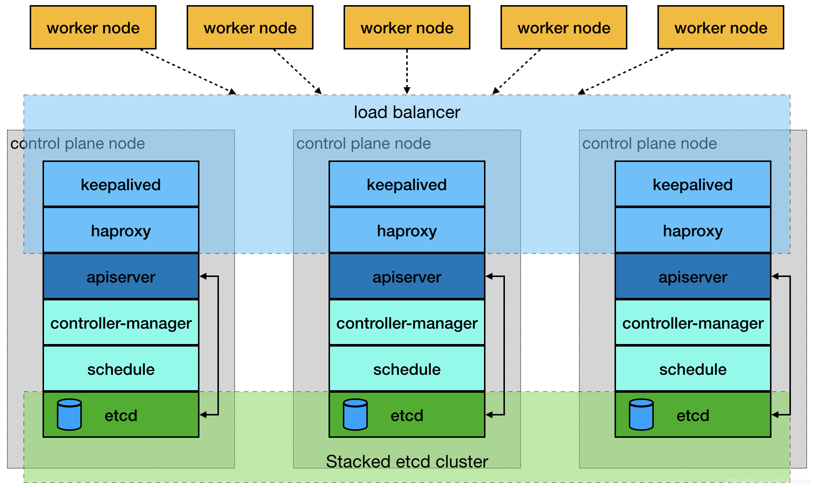
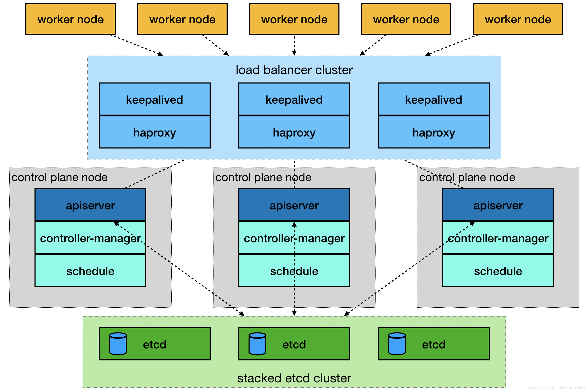

# CentOS 7下Kubernetes 1.16.4 + HAProxy + Keepalived 高可用集群安装

### 架构

Kubernetes高可用集群有两种部署方式，本文以第一种方式部署。

### 系统环境

	cat /etc/redhat-release
	CentOS Linux release 7.7.1908 (Core)
	 
	uname -a
	Linux k8s-master 3.10.0-1062.9.1.el7.x86_64 #1 SMP Fri Dec 6 15:49:49 UTC 2019 x86_64 x86_64 x86_64 GNU/Linux
	
	vi /etc/hosts
	192.168.1.60    vip.k8s.twingao.com    #虚拟IP地址，用于负载均衡，在三个主节点之间漂移。
	192.168.1.61    k8s-master1            #主节点1 + HAProxy + Keepalived
	192.168.1.62    k8s-master2            #主节点2 + HAProxy + Keepalived
	192.168.1.63    k8s-master3            #主节点3 + HAProxy + Keepalived
	192.168.1.64    k8s-node1              #工作节点1
	192.168.1.65    k8s-node2              #工作节点2
	192.168.1.66    k8s-node3              #工作节点3

关闭防火墙和安全设置。

	systemctl stop firewalld
	systemctl disable firewalld
	 
	vi /etc/fstab
	#/dev/mapper/centos-swap swap                    swap    defaults        0 0
	 
	vi /etc/selinux/config
	SELINUX=disabled
	 
	#重启生效
	reboot

安装Keepalived。

	yum install -y keepalived
	
	cp /etc/keepalived/keepalived.conf /etc/keepalived/keepalived.conf.bak
	
	vi /etc/keepalived/keepalived.conf
	# k8s-maseter1
	! Configuration File for keepalived
	
	global_defs {
	   router_id k8s-master1      #主机名
	}
	
	vrrp_instance VI_1 {
	    state MASTER              #不用修改，主要按照优先级确定
	    interface ens33           #vip所在的网卡
	    virtual_router_id 51
	    priority 150              #优先级，越大越优先
	    advert_int 1              #MASTER与BACKUP同步通知间隔，单位为秒
	    authentication {          #同一vrrp实例的MASTER与BACKUP使用相同的密码才能正常通信
	        auth_type PASS
	        auth_pass 1111
	    }
	    virtual_ipaddress {
	        192.168.1.60          #vip
	    }
	}
	
	# k8s-maseter2
	! Configuration File for keepalived
	
	global_defs {
	   router_id k8s-master2
	}
	
	vrrp_instance VI_1 {
	    state MASTER
	    interface ens33
	    virtual_router_id 51
	    priority 100
	    advert_int 1
	    authentication {
	        auth_type PASS
	        auth_pass 1111
	    }
	    virtual_ipaddress {
	        192.168.1.60
	    }
	}
	
	# k8s-maseter3
	! Configuration File for keepalived
	
	global_defs {
	   router_id k8s-master3
	}
	
	vrrp_instance VI_1 {
	    state MASTER
	    interface ens33
	    virtual_router_id 51
	    priority 50
	    advert_int 1
	    authentication {
	        auth_type PASS
	        auth_pass 1111
	    }
	    virtual_ipaddress {
	        192.168.1.60
	    }
	}
	
	systemctl start keepalived
	systemctl enable keepalived

由于k8s-master1节点的优先级最高，vip应该在k8s-master1，其它节点没有vip。

	ip addr show ens33
	2: ens33: <BROADCAST,MULTICAST,UP,LOWER_UP> mtu 1500 qdisc pfifo_fast state UP group default qlen 1000
	    link/ether 00:0c:29:3d:77:8f brd ff:ff:ff:ff:ff:ff
	    inet 192.168.1.61/24 brd 192.168.1.255 scope global noprefixroute ens33
	       valid_lft forever preferred_lft forever
	    inet 192.168.1.60/32 scope global ens33
	       valid_lft forever preferred_lft forever
	    inet6 fe80::20c:29ff:fe3d:778f/64 scope link
	       valid_lft forever preferred_lft forever

### 安装HAProxy

	yum install -y haproxy
	
	cp /etc/haproxy/haproxy.cfg /etc/haproxy/haproxy.cfg.bak
	
	vi /etc/haproxy/haproxy.cfg
	#三个master节点的配置相同。
	#---------------------------------------------------------------------
	# Example configuration for a possible web application.  See the
	# full configuration options online.
	#
	#   http://haproxy.1wt.eu/download/1.4/doc/configuration.txt
	#
	#---------------------------------------------------------------------
	
	#---------------------------------------------------------------------
	# Global settings
	#---------------------------------------------------------------------
	global
	    # to have these messages end up in /var/log/haproxy.log you will
	    # need to:
	    #
	    # 1) configure syslog to accept network log events.  This is done
	    #    by adding the '-r' option to the SYSLOGD_OPTIONS in
	    #    /etc/sysconfig/syslog
	    #
	    # 2) configure local2 events to go to the /var/log/haproxy.log
	    #   file. A line like the following can be added to
	    #   /etc/sysconfig/syslog
	    #
	    #    local2.*                       /var/log/haproxy.log
	    #
	    log         127.0.0.1 local2
	
	    chroot      /var/lib/haproxy
	    pidfile     /var/run/haproxy.pid
	    maxconn     4000
	    user        haproxy
	    group       haproxy
	    daemon
	
	    # turn on stats unix socket
	    stats socket /var/lib/haproxy/stats
	
	#---------------------------------------------------------------------
	# common defaults that all the 'listen' and 'backend' sections will
	# use if not designated in their block
	#---------------------------------------------------------------------
	defaults
	    mode                    tcp        #改为tcp
	    log                     global
	    option                  httplog
	    option                  dontlognull
	    option http-server-close
	    option forwardfor       except 127.0.0.0/8
	    option                  redispatch
	    retries                 3
	    timeout http-request    10s
	    timeout queue           1m
	    timeout connect         10s
	    timeout client          1m
	    timeout server          1m
	    timeout http-keep-alive 10s
	    timeout check           10s
	    maxconn                 3000
	
	#---------------------------------------------------------------------
	# main frontend which proxys to the backends
	#---------------------------------------------------------------------
	frontend  main *:8443             #改为8443，为HAProxy监听客户端的端口。
	    acl url_static       path_beg       -i /static /images /javascript /stylesheets
	    acl url_static       path_end       -i .jpg .gif .png .css .js
	
	    use_backend static          if url_static
	    default_backend             k8s        #改为k8s，与backend k8s对应
	
	#---------------------------------------------------------------------
	# static backend for serving up images, stylesheets and such
	#---------------------------------------------------------------------
	backend static
	    balance     roundrobin
	    server      static 127.0.0.1:4331 check
	
	#---------------------------------------------------------------------
	# round robin balancing between the various backends
	#---------------------------------------------------------------------
	backend k8s            #负载均衡k8s的api-server，对应三个k8s-master节点。
	    balance     roundrobin
	    server k8s-master1 192.168.1.61:6443 check
	    server k8s-master2 192.168.1.62:6443 check
	    server k8s-master3 192.168.1.63:6443 check
	
	systemctl start haproxy
	systemctl enable haproxy

### 安装Kubernetes

修改内核参数。

	cat <<EOF> /etc/sysctl.d/k8s.conf
	net.bridge.bridge-nf-call-ip6tables = 1
	net.bridge.bridge-nf-call-iptables = 1
	EOF
	 
	modprobe br_netfilter
	sysctl --system
	
	* Applying /usr/lib/sysctl.d/00-system.conf ...
	net.bridge.bridge-nf-call-ip6tables = 0
	net.bridge.bridge-nf-call-iptables = 0
	net.bridge.bridge-nf-call-arptables = 0
	* Applying /usr/lib/sysctl.d/10-default-yama-scope.conf ...
	kernel.yama.ptrace_scope = 0
	* Applying /usr/lib/sysctl.d/50-default.conf ...
	kernel.sysrq = 16
	kernel.core_uses_pid = 1
	net.ipv4.conf.default.rp_filter = 1
	net.ipv4.conf.all.rp_filter = 1
	net.ipv4.conf.default.accept_source_route = 0
	net.ipv4.conf.all.accept_source_route = 0
	net.ipv4.conf.default.promote_secondaries = 1
	net.ipv4.conf.all.promote_secondaries = 1
	fs.protected_hardlinks = 1
	fs.protected_symlinks = 1
	* Applying /etc/sysctl.d/99-sysctl.conf ...
	* Applying /etc/sysctl.d/k8s.conf ...
	#注意需要有以下两行
	net.bridge.bridge-nf-call-ip6tables = 1
	net.bridge.bridge-nf-call-iptables = 1
	* Applying /etc/sysctl.conf ...

安装Docker。

	yum install -y yum-utils device-mapper-persistent-data lvm2
	 
	yum-config-manager --add-repo https://download.docker.com/linux/centos/docker-ce.repo
	或者
	#yum-config-manager --add-repo http://mirrors.aliyun.com/docker-ce/linux/centos/docker-ce.repo
	 
	yum list docker-ce --showduplicates | sort -r
	已加载插件：fastestmirror
	可安装的软件包
	 * updates: mirrors.huaweicloud.com
	Loading mirror speeds from cached hostfile
	 * extras: mirror.bit.edu.cn
	docker-ce.x86_64            3:19.03.5-3.el7                     docker-ce-stable
	docker-ce.x86_64            3:19.03.4-3.el7                     docker-ce-stable
	docker-ce.x86_64            3:19.03.3-3.el7                     docker-ce-stable
	docker-ce.x86_64            3:19.03.2-3.el7                     docker-ce-stable
	docker-ce.x86_64            3:19.03.1-3.el7                     docker-ce-stable
	docker-ce.x86_64            3:19.03.0-3.el7                     docker-ce-stable
	docker-ce.x86_64            3:18.09.9-3.el7                     docker-ce-stable
	docker-ce.x86_64            3:18.09.8-3.el7                     docker-ce-stable
	docker-ce.x86_64            3:18.09.7-3.el7                     docker-ce-stable
	docker-ce.x86_64            3:18.09.6-3.el7                     docker-ce-stable
	docker-ce.x86_64            3:18.09.5-3.el7                     docker-ce-stable
	docker-ce.x86_64            3:18.09.4-3.el7                     docker-ce-stable
	......
	 * base: mirrors.tuna.tsinghua.edu.cn
	 
	yum install -y docker-ce-19.03.5-3.el7
	 
	docker version
	Client: Docker Engine - Community
	 Version:           19.03.5
	 API version:       1.40
	 Go version:        go1.12.12
	 Git commit:        633a0ea
	 Built:             Wed Nov 13 07:25:41 2019
	 OS/Arch:           linux/amd64
	 Experimental:      false
	
	Server: Docker Engine - Community
	 Engine:
	  Version:          19.03.5
	  API version:      1.40 (minimum version 1.12)
	  Go version:       go1.12.12
	  Git commit:       633a0ea
	  Built:            Wed Nov 13 07:24:18 2019
	  OS/Arch:          linux/amd64
	  Experimental:     false
	 containerd:
	  Version:          1.2.10
	  GitCommit:        b34a5c8af56e510852c35414db4c1f4fa6172339
	 runc:
	  Version:          1.0.0-rc8+dev
	  GitCommit:        3e425f80a8c931f88e6d94a8c831b9d5aa481657
	 docker-init:
	  Version:          0.18.0
	  GitCommit:        fec3683
	 
	systemctl start docker
	systemctl enable docker

设置Kubernetes的yum源。

	cat <<EOF> /etc/yum.repos.d/kubernetes.repo
	[kubernetes]
	name=Kubernetes
	baseurl=https://mirrors.aliyun.com/kubernetes/yum/repos/kubernetes-el7-x86_64/
	enabled=1
	gpgcheck=1
	repo_gpgcheck=1
	gpgkey=https://mirrors.aliyun.com/kubernetes/yum/doc/yum-key.gpg https://mirrors.aliyun.com/kubernetes/yum/doc/rpm-package-key.gpg
	EOF

安装kubeadmin、kubectl和kubelet服务。

	yum list -y kubeadm --showduplicates
	已加载插件：fastestmirror
	Loading mirror speeds from cached hostfile
	 * base: mirror.bit.edu.cn
	 * extras: mirror.bit.edu.cn
	 * updates: mirror.jdcloud.com
	可安装的软件包
	kubeadm.x86_64                                                          1.6.0-0                                                             kubernetes
	kubeadm.x86_64                                                          1.6.1-0                                                             kubernetes
	kubeadm.x86_64                                                          1.6.2-0                                                             kubernetes
	kubeadm.x86_64                                                          1.6.3-0                                                             kubernetes
	......
	kubeadm.x86_64                                                          1.13.0-0                                                            kubernetes
	kubeadm.x86_64                                                          1.13.1-0                                                            kubernetes
	kubeadm.x86_64                                                          1.13.2-0                                                            kubernetes
	kubeadm.x86_64                                                          1.13.3-0                                                            kubernetes
	kubeadm.x86_64                                                          1.13.4-0                                                            kubernetes
	kubeadm.x86_64                                                          1.13.5-0                                                            kubernetes
	kubeadm.x86_64                                                          1.13.6-0                                                            kubernetes
	kubeadm.x86_64                                                          1.13.7-0                                                            kubernetes
	kubeadm.x86_64                                                          1.13.8-0                                                            kubernetes
	kubeadm.x86_64                                                          1.13.9-0                                                            kubernetes
	kubeadm.x86_64                                                          1.13.10-0                                                           kubernetes
	kubeadm.x86_64                                                          1.13.11-0                                                           kubernetes
	kubeadm.x86_64                                                          1.13.12-0                                                           kubernetes
	kubeadm.x86_64                                                          1.14.0-0                                                            kubernetes
	kubeadm.x86_64                                                          1.14.1-0                                                            kubernetes
	kubeadm.x86_64                                                          1.14.2-0                                                            kubernetes
	kubeadm.x86_64                                                          1.14.3-0                                                            kubernetes
	kubeadm.x86_64                                                          1.14.4-0                                                            kubernetes
	kubeadm.x86_64                                                          1.14.5-0                                                            kubernetes
	kubeadm.x86_64                                                          1.14.6-0                                                            kubernetes
	kubeadm.x86_64                                                          1.14.7-0                                                            kubernetes
	kubeadm.x86_64                                                          1.14.8-0                                                            kubernetes
	kubeadm.x86_64                                                          1.14.9-0                                                            kubernetes
	kubeadm.x86_64                                                          1.14.10-0                                                           kubernetes
	kubeadm.x86_64                                                          1.15.0-0                                                            kubernetes
	kubeadm.x86_64                                                          1.15.1-0                                                            kubernetes
	kubeadm.x86_64                                                          1.15.2-0                                                            kubernetes
	kubeadm.x86_64                                                          1.15.3-0                                                            kubernetes
	kubeadm.x86_64                                                          1.15.4-0                                                            kubernetes
	kubeadm.x86_64                                                          1.15.5-0                                                            kubernetes
	kubeadm.x86_64                                                          1.15.6-0                                                            kubernetes
	kubeadm.x86_64                                                          1.15.7-0                                                            kubernetes
	kubeadm.x86_64                                                          1.16.0-0                                                            kubernetes
	kubeadm.x86_64                                                          1.16.1-0                                                            kubernetes
	kubeadm.x86_64                                                          1.16.2-0                                                            kubernetes
	kubeadm.x86_64                                                          1.16.3-0                                                            kubernetes
	kubeadm.x86_64                                                          1.16.4-0                                                            kubernetes
	kubeadm.x86_64                                                          1.17.0-0                                                            kubernetes
	
	yum install -y kubeadm-1.16.4-0 kubectl-1.16.4-0 kubelet-1.16.4-0
	 
	kubeadm version
	kubeadm version: &version.Info{Major:"1", Minor:"16", GitVersion:"v1.16.4", GitCommit:"224be7bdce5a9dd0c2fd0d46b83865648e2fe0ba", GitTreeState:"clean", BuildDate:"2019-12-11T12:44:45Z", GoVersion:"go1.12.12", Compiler:"gc", Platform:"linux/amd64"}
	 
	systemctl start kubelet
	systemctl enable kubelet

提前下载好所需的七个镜像。

	kubeadm config images pull --image-repository=registry.aliyuncs.com/google_containers
	
	W1220 21:38:53.193429   18919 version.go:101] could not fetch a Kubernetes version from the internet: unable to get URL "https://dl.k8s.io/release/stable-1.txt": Get https://dl.k8s.io/release/stable-1.txt: net/http: request canceled while waiting for connection (Client.Timeout exceeded while awaiting headers)
	W1220 21:38:53.193913   18919 version.go:102] falling back to the local client version: v1.16.4
	[config/images] Pulled registry.aliyuncs.com/google_containers/kube-apiserver:v1.16.4
	[config/images] Pulled registry.aliyuncs.com/google_containers/kube-controller-manager:v1.16.4
	[config/images] Pulled registry.aliyuncs.com/google_containers/kube-scheduler:v1.16.4
	[config/images] Pulled registry.aliyuncs.com/google_containers/kube-proxy:v1.16.4
	[config/images] Pulled registry.aliyuncs.com/google_containers/pause:3.1
	[config/images] Pulled registry.aliyuncs.com/google_containers/etcd:3.3.15-0
	[config/images] Pulled registry.aliyuncs.com/google_containers/coredns:1.6.2
	
	docker images
	REPOSITORY                                                        TAG                 IMAGE ID            CREATED             SIZE
	registry.aliyuncs.com/google_containers/kube-apiserver            v1.16.4             3722a80984a0        9 days ago          217MB
	registry.aliyuncs.com/google_containers/kube-controller-manager   v1.16.4             fb4cca6b4e4c        9 days ago          163MB
	registry.aliyuncs.com/google_containers/kube-proxy                v1.16.4             091df896d78f        9 days ago          86.1MB
	registry.aliyuncs.com/google_containers/kube-scheduler            v1.16.4             2984964036c8        9 days ago          87.3MB
	registry.aliyuncs.com/google_containers/etcd                      3.3.15-0            b2756210eeab        3 months ago        247MB
	registry.aliyuncs.com/google_containers/coredns                   1.6.2               bf261d157914        4 months ago        44.1MB
	registry.aliyuncs.com/google_containers/pause                     3.1                 da86e6ba6ca1        24 months ago       742kB

初始化Master节点。

	# –-pod-network-cidr：用于指定Pod的网络范围
	# –-service-cidr：用于指定service的网络范围；
	# --image-repository: 镜像仓库的地址，和提前下载的镜像仓库应该对应上。
	# --control-plane-endpoint：对应vip。
	
	kubeadm init \
	    --kubernetes-version=v1.16.4 \
	    --pod-network-cidr=10.244.0.0/16 \
	    --service-cidr=10.1.0.0/16 \
	    --control-plane-endpoint=192.168.1.60:8443 \
	    --image-repository=registry.aliyuncs.com/google_containers \
	    --upload-certs
	[init] Using Kubernetes version: v1.16.4
	[preflight] Running pre-flight checks
	        [WARNING IsDockerSystemdCheck]: detected "cgroupfs" as the Docker cgroup driver. The recommended driver is "systemd". Please follow the guide at https://kubernetes.io/docs/setup/cri/
	        [WARNING SystemVerification]: this Docker version is not on the list of validated versions: 19.03.5. Latest validated version: 18.09
	[preflight] Pulling images required for setting up a Kubernetes cluster
	[preflight] This might take a minute or two, depending on the speed of your internet connection
	[preflight] You can also perform this action in beforehand using 'kubeadm config images pull'
	[kubelet-start] Writing kubelet environment file with flags to file "/var/lib/kubelet/kubeadm-flags.env"
	[kubelet-start] Writing kubelet configuration to file "/var/lib/kubelet/config.yaml"
	[kubelet-start] Activating the kubelet service
	[certs] Using certificateDir folder "/etc/kubernetes/pki"
	[certs] Generating "ca" certificate and key
	[certs] Generating "apiserver" certificate and key
	[certs] apiserver serving cert is signed for DNS names [k8s-master1 kubernetes kubernetes.default kubernetes.default.svc kubernetes.default.svc.cluster.local] and IPs [10.1.0.1 192.168.1.61 192.168.1.60]
	[certs] Generating "apiserver-kubelet-client" certificate and key
	[certs] Generating "front-proxy-ca" certificate and key
	[certs] Generating "front-proxy-client" certificate and key
	[certs] Generating "etcd/ca" certificate and key
	[certs] Generating "etcd/server" certificate and key
	[certs] etcd/server serving cert is signed for DNS names [k8s-master1 localhost] and IPs [192.168.1.61 127.0.0.1 ::1]
	[certs] Generating "etcd/peer" certificate and key
	[certs] etcd/peer serving cert is signed for DNS names [k8s-master1 localhost] and IPs [192.168.1.61 127.0.0.1 ::1]
	[certs] Generating "etcd/healthcheck-client" certificate and key
	[certs] Generating "apiserver-etcd-client" certificate and key
	[certs] Generating "sa" key and public key
	[kubeconfig] Using kubeconfig folder "/etc/kubernetes"
	[endpoint] WARNING: port specified in controlPlaneEndpoint overrides bindPort in the controlplane address
	[kubeconfig] Writing "admin.conf" kubeconfig file
	[endpoint] WARNING: port specified in controlPlaneEndpoint overrides bindPort in the controlplane address
	[kubeconfig] Writing "kubelet.conf" kubeconfig file
	[endpoint] WARNING: port specified in controlPlaneEndpoint overrides bindPort in the controlplane address
	[kubeconfig] Writing "controller-manager.conf" kubeconfig file
	[endpoint] WARNING: port specified in controlPlaneEndpoint overrides bindPort in the controlplane address
	[kubeconfig] Writing "scheduler.conf" kubeconfig file
	[control-plane] Using manifest folder "/etc/kubernetes/manifests"
	[control-plane] Creating static Pod manifest for "kube-apiserver"
	[control-plane] Creating static Pod manifest for "kube-controller-manager"
	[control-plane] Creating static Pod manifest for "kube-scheduler"
	[etcd] Creating static Pod manifest for local etcd in "/etc/kubernetes/manifests"
	[wait-control-plane] Waiting for the kubelet to boot up the control plane as static Pods from directory "/etc/kubernetes/manifests". This can take up to 4m0s
	[kubelet-check] Initial timeout of 40s passed.
	[apiclient] All control plane components are healthy after 52.509029 seconds
	[upload-config] Storing the configuration used in ConfigMap "kubeadm-config" in the "kube-system" Namespace
	[kubelet] Creating a ConfigMap "kubelet-config-1.16" in namespace kube-system with the configuration for the kubelets in the cluster
	[upload-certs] Storing the certificates in Secret "kubeadm-certs" in the "kube-system" Namespace
	[upload-certs] Using certificate key:
	5a8d6ff5506f5385e9e217fe69f2ce39a32bbc34f27c29ed734ad1f1f1c41b6c
	[mark-control-plane] Marking the node k8s-master1 as control-plane by adding the label "node-role.kubernetes.io/master=''"
	[mark-control-plane] Marking the node k8s-master1 as control-plane by adding the taints [node-role.kubernetes.io/master:NoSchedule]
	[bootstrap-token] Using token: l5y72a.l83pc5s3xje0legu
	[bootstrap-token] Configuring bootstrap tokens, cluster-info ConfigMap, RBAC Roles
	[bootstrap-token] configured RBAC rules to allow Node Bootstrap tokens to post CSRs in order for nodes to get long term certificate credentials
	[bootstrap-token] configured RBAC rules to allow the csrapprover controller automatically approve CSRs from a Node Bootstrap Token
	[bootstrap-token] configured RBAC rules to allow certificate rotation for all node client certificates in the cluster
	[bootstrap-token] Creating the "cluster-info" ConfigMap in the "kube-public" namespace
	[addons] Applied essential addon: CoreDNS
	[endpoint] WARNING: port specified in controlPlaneEndpoint overrides bindPort in the controlplane address
	[addons] Applied essential addon: kube-proxy
	
	Your Kubernetes control-plane has initialized successfully!
	
	To start using your cluster, you need to run the following as a regular user:
	
	  mkdir -p $HOME/.kube
	  sudo cp -i /etc/kubernetes/admin.conf $HOME/.kube/config
	  sudo chown $(id -u):$(id -g) $HOME/.kube/config
	
	You should now deploy a pod network to the cluster.
	Run "kubectl apply -f [podnetwork].yaml" with one of the options listed at:
	  https://kubernetes.io/docs/concepts/cluster-administration/addons/
	
	You can now join any number of the control-plane node running the following command on each as root:
	
	  kubeadm join 192.168.1.60:8443 --token l5y72a.l83pc5s3xje0legu \
	    --discovery-token-ca-cert-hash sha256:5ecd180bb1b15e86c1400d026cf3830032a63e597a1389566485ff4e71de0fa5 \
	    --control-plane --certificate-key 5a8d6ff5506f5385e9e217fe69f2ce39a32bbc34f27c29ed734ad1f1f1c41b6c
	
	Please note that the certificate-key gives access to cluster sensitive data, keep it secret!
	As a safeguard, uploaded-certs will be deleted in two hours; If necessary, you can use
	"kubeadm init phase upload-certs --upload-certs" to reload certs afterward.
	
	Then you can join any number of worker nodes by running the following on each as root:
	
	kubeadm join 192.168.1.60:8443 --token l5y72a.l83pc5s3xje0legu \
	    --discovery-token-ca-cert-hash sha256:5ecd180bb1b15e86c1400d026cf3830032a63e597a1389566485ff4e71de0fa5

初始化完成后，需要按照提示执行以下命令。注意两个join命令后续会使用到，需要记录。

	mkdir -p $HOME/.kube
	sudo cp -i /etc/kubernetes/admin.conf $HOME/.kube/config
	sudo chown $(id -u):$(id -g) $HOME/.kube/config

查看Kubernetes状态。

	kubectl get nodes
	NAME          STATUS     ROLES    AGE     VERSION
	k8s-master1   NotReady   master   4m27s   v1.16.4
	
	kubectl get all -n kube-system
	NAME                                      READY   STATUS    RESTARTS   AGE
	pod/coredns-58cc8c89f4-47jd8              0/1     Pending   0          6m33s
	pod/coredns-58cc8c89f4-n82jr              0/1     Pending   0          6m33s
	pod/etcd-k8s-master1                      1/1     Running   0          5m58s
	pod/kube-apiserver-k8s-master1            1/1     Running   0          42s
	pod/kube-controller-manager-k8s-master1   1/1     Running   1          6m7s
	pod/kube-proxy-wv7cl                      1/1     Running   0          6m33s
	pod/kube-scheduler-k8s-master1            1/1     Running   1          6m1s
	
	NAME               TYPE        CLUSTER-IP   EXTERNAL-IP   PORT(S)                  AGE
	service/kube-dns   ClusterIP   10.1.0.10    <none>        53/UDP,53/TCP,9153/TCP   6m48s
	
	NAME                        DESIRED   CURRENT   READY   UP-TO-DATE   AVAILABLE   NODE SELECTOR                 AGE
	daemonset.apps/kube-proxy   1         1         1       1            1           beta.kubernetes.io/os=linux   6m48s
	
	NAME                      READY   UP-TO-DATE   AVAILABLE   AGE
	deployment.apps/coredns   0/2     2            0           6m48s
	
	NAME                                 DESIRED   CURRENT   READY   AGE
	replicaset.apps/coredns-58cc8c89f4   2         2         0       6m33s

部署flannel网络。

	mkdir k8s
	cd k8s
	 
	#该地址可能无法访问。
	wget https://raw.githubusercontent.com/coreos/flannel/master/Documentation/kube-flannel.yml
	 
	#直接下载代码仓库 https://github.com/coreos/flannel，下载为flannel-master.zip文件，解压文件，
	#将flannel-master\Documentation\kube-flannel.yml上传到k8s-master节点。
	#可将kube-flannel.yml之中kube-flannel-ds-amd64之后的DaemonSet删除。
	 
	# 可以提前将镜像拉下来。四个节点都操作。
	docker pull quay.io/coreos/flannel:v0.11.0-amd64
	
	kubectl get nodes
	NAME          STATUS   ROLES    AGE   VERSION
	k8s-master1   Ready    master   10m   v1.16.4
	
	kubectl get all -n kube-system
	NAME                                      READY   STATUS    RESTARTS   AGE
	pod/coredns-58cc8c89f4-47jd8              0/1     Running   0          10m
	pod/coredns-58cc8c89f4-n82jr              1/1     Running   0          10m
	pod/etcd-k8s-master1                      1/1     Running   0          10m
	pod/kube-apiserver-k8s-master1            1/1     Running   0          4m51s
	pod/kube-controller-manager-k8s-master1   1/1     Running   1          10m
	pod/kube-flannel-ds-amd64-h6jnh           1/1     Running   0          20s
	pod/kube-proxy-wv7cl                      1/1     Running   0          10m
	pod/kube-scheduler-k8s-master1            1/1     Running   1          10m
	
	NAME               TYPE        CLUSTER-IP   EXTERNAL-IP   PORT(S)                  AGE
	service/kube-dns   ClusterIP   10.1.0.10    <none>        53/UDP,53/TCP,9153/TCP   10m
	
	NAME                                   DESIRED   CURRENT   READY   UP-TO-DATE   AVAILABLE   NODE SELECTOR                 AGE
	daemonset.apps/kube-flannel-ds-amd64   1         1         1       1            1           <none>                        20s
	daemonset.apps/kube-proxy              1         1         1       1            1           beta.kubernetes.io/os=linux   10m
	
	NAME                      READY   UP-TO-DATE   AVAILABLE   AGE
	deployment.apps/coredns   1/2     2            1           10m
	
	NAME                                 DESIRED   CURRENT   READY   AGE
	replicaset.apps/coredns-58cc8c89f4   2         2         1       10m

将另外两个master节点Join到集群中，使用上面初始化时的第一条Join命令。

	kubeadm join 192.168.1.60:8443 --token l5y72a.l83pc5s3xje0legu \
	    --discovery-token-ca-cert-hash sha256:5ecd180bb1b15e86c1400d026cf3830032a63e597a1389566485ff4e71de0fa5 \
	    --control-plane --certificate-key 5a8d6ff5506f5385e9e217fe69f2ce39a32bbc34f27c29ed734ad1f1f1c41b6c
	[preflight] Running pre-flight checks
	        [WARNING IsDockerSystemdCheck]: detected "cgroupfs" as the Docker cgroup driver. The recommended driver is "systemd". Please follow the guide at https://kubernetes.io/docs/setup/cri/
	        [WARNING SystemVerification]: this Docker version is not on the list of validated versions: 19.03.5. Latest validated version: 18.09
	[preflight] Reading configuration from the cluster...
	[preflight] FYI: You can look at this config file with 'kubectl -n kube-system get cm kubeadm-config -oyaml'
	[preflight] Running pre-flight checks before initializing the new control plane instance
	[preflight] Pulling images required for setting up a Kubernetes cluster
	[preflight] This might take a minute or two, depending on the speed of your internet connection
	[preflight] You can also perform this action in beforehand using 'kubeadm config images pull'
	[download-certs] Downloading the certificates in Secret "kubeadm-certs" in the "kube-system" Namespace
	[certs] Using certificateDir folder "/etc/kubernetes/pki"
	[certs] Generating "apiserver-etcd-client" certificate and key
	[certs] Generating "etcd/peer" certificate and key
	[certs] etcd/peer serving cert is signed for DNS names [k8s-master2 localhost] and IPs [192.168.1.62 127.0.0.1 ::1]
	[certs] Generating "etcd/server" certificate and key
	[certs] etcd/server serving cert is signed for DNS names [k8s-master2 localhost] and IPs [192.168.1.62 127.0.0.1 ::1]
	[certs] Generating "etcd/healthcheck-client" certificate and key
	[certs] Generating "apiserver-kubelet-client" certificate and key
	[certs] Generating "apiserver" certificate and key
	[certs] apiserver serving cert is signed for DNS names [k8s-master2 kubernetes kubernetes.default kubernetes.default.svc kubernetes.default.svc.cluster.local] and IPs [10.1.0.1 192.168.1.62 192.168.1.60]
	[certs] Generating "front-proxy-client" certificate and key
	[certs] Valid certificates and keys now exist in "/etc/kubernetes/pki"
	[certs] Using the existing "sa" key
	[kubeconfig] Generating kubeconfig files
	[kubeconfig] Using kubeconfig folder "/etc/kubernetes"
	[endpoint] WARNING: port specified in controlPlaneEndpoint overrides bindPort in the controlplane address
	[kubeconfig] Writing "admin.conf" kubeconfig file
	[kubeconfig] Writing "controller-manager.conf" kubeconfig file
	[kubeconfig] Writing "scheduler.conf" kubeconfig file
	[control-plane] Using manifest folder "/etc/kubernetes/manifests"
	[control-plane] Creating static Pod manifest for "kube-apiserver"
	[control-plane] Creating static Pod manifest for "kube-controller-manager"
	[control-plane] Creating static Pod manifest for "kube-scheduler"
	[check-etcd] Checking that the etcd cluster is healthy
	[kubelet-start] Downloading configuration for the kubelet from the "kubelet-config-1.16" ConfigMap in the kube-system namespace
	[kubelet-start] Writing kubelet configuration to file "/var/lib/kubelet/config.yaml"
	[kubelet-start] Writing kubelet environment file with flags to file "/var/lib/kubelet/kubeadm-flags.env"
	[kubelet-start] Activating the kubelet service
	[kubelet-start] Waiting for the kubelet to perform the TLS Bootstrap...
	[etcd] Announced new etcd member joining to the existing etcd cluster
	[etcd] Creating static Pod manifest for "etcd"
	[etcd] Waiting for the new etcd member to join the cluster. This can take up to 40s
	{"level":"warn","ts":"2019-12-21T13:00:20.321+0800","caller":"clientv3/retry_interceptor.go:61","msg":"retrying of unary invoker failed","target":"passthrough:///https://192.168.1.62:2379","attempt":0,"error":"rpc error: code = DeadlineExceeded desc = context deadline exceeded"}
	[kubelet-check] Initial timeout of 40s passed.
	[upload-config] Storing the configuration used in ConfigMap "kubeadm-config" in the "kube-system" Namespace
	[mark-control-plane] Marking the node k8s-master2 as control-plane by adding the label "node-role.kubernetes.io/master=''"
	[mark-control-plane] Marking the node k8s-master2 as control-plane by adding the taints [node-role.kubernetes.io/master:NoSchedule]
	
	This node has joined the cluster and a new control plane instance was created:
	
	* Certificate signing request was sent to apiserver and approval was received.
	* The Kubelet was informed of the new secure connection details.
	* Control plane (master) label and taint were applied to the new node.
	* The Kubernetes control plane instances scaled up.
	* A new etcd member was added to the local/stacked etcd cluster.
	
	To start administering your cluster from this node, you need to run the following as a regular user:
	
	        mkdir -p $HOME/.kube
	        sudo cp -i /etc/kubernetes/admin.conf $HOME/.kube/config
	        sudo chown $(id -u):$(id -g) $HOME/.kube/config
	
	Run 'kubectl get nodes' to see this node join the cluster.

Join操作后，依然需要按照提示执行以下命令。

	mkdir -p $HOME/.kube
	sudo cp -i /etc/kubernetes/admin.conf $HOME/.kube/config
	sudo chown $(id -u):$(id -g) $HOME/.kube/config

修改Service的nodePort缺省取值范围。需要在三个master节点都操作。

	vi /etc/kubernetes/manifests/kube-apiserver.yaml
	- --service-node-port-range=1-39999
	 
	systemctl daemon-reload
	systemctl restart kubelet

查看Kubernetes状态。

	kubectl get nodes
	NAME          STATUS   ROLES    AGE     VERSION
	k8s-master1   Ready    master   23m     v1.16.4
	k8s-master2   Ready    master   6m14s   v1.16.4
	k8s-master3   Ready    master   6m1s    v1.16.4
	
	kubectl get all -n kube-system
	NAME                                      READY   STATUS    RESTARTS   AGE
	pod/coredns-58cc8c89f4-47jd8              1/1     Running   0          23m
	pod/coredns-58cc8c89f4-n82jr              1/1     Running   0          23m
	pod/etcd-k8s-master1                      1/1     Running   0          22m
	pod/etcd-k8s-master2                      1/1     Running   0          6m28s
	pod/etcd-k8s-master3                      1/1     Running   0          6m7s
	pod/kube-apiserver-k8s-master1            1/1     Running   0          17m
	pod/kube-apiserver-k8s-master2            1/1     Running   0          89s
	pod/kube-apiserver-k8s-master3            1/1     Running   0          84s
	pod/kube-controller-manager-k8s-master1   1/1     Running   2          22m
	pod/kube-controller-manager-k8s-master2   1/1     Running   0          6m28s
	pod/kube-controller-manager-k8s-master3   1/1     Running   0          4m57s
	pod/kube-flannel-ds-amd64-7xtgt           1/1     Running   0          5m34s
	pod/kube-flannel-ds-amd64-gcdng           1/1     Running   1          6m29s
	pod/kube-flannel-ds-amd64-h6jnh           1/1     Running   0          12m
	pod/kube-proxy-lrlfb                      1/1     Running   0          6m29s
	pod/kube-proxy-shgbc                      1/1     Running   0          5m34s
	pod/kube-proxy-wv7cl                      1/1     Running   0          23m
	pod/kube-scheduler-k8s-master1            1/1     Running   2          22m
	pod/kube-scheduler-k8s-master2            1/1     Running   0          6m28s
	pod/kube-scheduler-k8s-master3            1/1     Running   0          4m48s
	
	NAME               TYPE        CLUSTER-IP   EXTERNAL-IP   PORT(S)                  AGE
	service/kube-dns   ClusterIP   10.1.0.10    <none>        53/UDP,53/TCP,9153/TCP   23m
	
	NAME                                   DESIRED   CURRENT   READY   UP-TO-DATE   AVAILABLE   NODE SELECTOR                 AGE
	daemonset.apps/kube-flannel-ds-amd64   3         3         3       3            3           <none>                        12m
	daemonset.apps/kube-proxy              3         3         3       3            3           beta.kubernetes.io/os=linux   23m
	
	NAME                      READY   UP-TO-DATE   AVAILABLE   AGE
	deployment.apps/coredns   2/2     2            2           23m
	
	NAME                                 DESIRED   CURRENT   READY   AGE
	replicaset.apps/coredns-58cc8c89f4   2         2         2       23m

将工作节点Join到Kubernetes集群中。

	kubeadm join 192.168.1.60:8443 --token l5y72a.l83pc5s3xje0legu \
	    --discovery-token-ca-cert-hash sha256:5ecd180bb1b15e86c1400d026cf3830032a63e597a1389566485ff4e71de0fa5
	[preflight] Running pre-flight checks
	        [WARNING IsDockerSystemdCheck]: detected "cgroupfs" as the Docker cgroup driver. The recommended driver is "systemd". Please follow the guide at https://kubernetes.io/docs/setup/cri/
	        [WARNING SystemVerification]: this Docker version is not on the list of validated versions: 19.03.5. Latest validated version: 18.09
	        [WARNING Hostname]: hostname "k8s-node1" could not be reached
	        [WARNING Hostname]: hostname "k8s-node1": lookup k8s-node1 on 192.168.1.1:53: no such host
	[preflight] Reading configuration from the cluster...
	[preflight] FYI: You can look at this config file with 'kubectl -n kube-system get cm kubeadm-config -oyaml'
	[kubelet-start] Downloading configuration for the kubelet from the "kubelet-config-1.16" ConfigMap in the kube-system namespace
	[kubelet-start] Writing kubelet configuration to file "/var/lib/kubelet/config.yaml"
	[kubelet-start] Writing kubelet environment file with flags to file "/var/lib/kubelet/kubeadm-flags.env"
	[kubelet-start] Activating the kubelet service
	[kubelet-start] Waiting for the kubelet to perform the TLS Bootstrap...
	
	This node has joined the cluster:
	* Certificate signing request was sent to apiserver and a response was received.
	* The Kubelet was informed of the new secure connection details.
	
	Run 'kubectl get nodes' on the control-plane to see this node join the cluster.
	
	mkdir -p $HOME/.kube
	scp 192.168.1.60:/root/.kube/config $HOME/.kube/config

查看Kubernetes状态。

	kubectl get nodes
	NAME          STATUS   ROLES    AGE     VERSION
	k8s-master1   Ready    master   29m     v1.16.4
	k8s-master2   Ready    master   13m     v1.16.4
	k8s-master3   Ready    master   12m     v1.16.4
	k8s-node1     Ready    <none>   2m50s   v1.16.4
	k8s-node2     Ready    <none>   2m48s   v1.16.4
	k8s-node3     Ready    <none>   2m44s   v1.16.4
	
	kubectl get all -n kube-system
	NAME                                      READY   STATUS    RESTARTS   AGE
	pod/coredns-58cc8c89f4-47jd8              1/1     Running   0          29m
	pod/coredns-58cc8c89f4-n82jr              1/1     Running   0          29m
	pod/etcd-k8s-master1                      1/1     Running   0          29m
	pod/etcd-k8s-master2                      1/1     Running   0          13m
	pod/etcd-k8s-master3                      1/1     Running   0          12m
	pod/kube-apiserver-k8s-master1            1/1     Running   0          23m
	pod/kube-apiserver-k8s-master2            1/1     Running   0          8m12s
	pod/kube-apiserver-k8s-master3            1/1     Running   0          8m7s
	pod/kube-controller-manager-k8s-master1   1/1     Running   2          29m
	pod/kube-controller-manager-k8s-master2   1/1     Running   0          13m
	pod/kube-controller-manager-k8s-master3   1/1     Running   0          11m
	pod/kube-flannel-ds-amd64-7xtgt           1/1     Running   0          12m
	pod/kube-flannel-ds-amd64-gcdng           1/1     Running   1          13m
	pod/kube-flannel-ds-amd64-h6jnh           1/1     Running   0          19m
	pod/kube-flannel-ds-amd64-qhzln           1/1     Running   0          2m59s
	pod/kube-flannel-ds-amd64-v5zsz           1/1     Running   0          3m1s
	pod/kube-flannel-ds-amd64-ashee           1/1     Running   0          3m1s
	pod/kube-proxy-fwh4g                      1/1     Running   0          3m1s
	pod/kube-proxy-lrlfb                      1/1     Running   0          13m
	pod/kube-proxy-shgbc                      1/1     Running   0          12m
	pod/kube-proxy-tr47m                      1/1     Running   0          2m59s
	pod/kube-proxy-wv7cl                      1/1     Running   0          29m
	pod/kube-proxy-asdfe                      1/1     Running   0          29m
	pod/kube-scheduler-k8s-master1            1/1     Running   2          29m
	pod/kube-scheduler-k8s-master2            1/1     Running   0          13m
	pod/kube-scheduler-k8s-master3            1/1     Running   0          11m
	
	NAME               TYPE        CLUSTER-IP   EXTERNAL-IP   PORT(S)                  AGE
	service/kube-dns   ClusterIP   10.1.0.10    <none>        53/UDP,53/TCP,9153/TCP   30m
	
	NAME                                   DESIRED   CURRENT   READY   UP-TO-DATE   AVAILABLE   NODE SELECTOR                 AGE
	daemonset.apps/kube-flannel-ds-amd64   5         5         5       5            5           <none>                        19m
	daemonset.apps/kube-proxy              5         5         5       5            5           beta.kubernetes.io/os=linux   30m
	
	NAME                      READY   UP-TO-DATE   AVAILABLE   AGE
	deployment.apps/coredns   2/2     2            2           30m
	
	NAME                                 DESIRED   CURRENT   READY   AGE
	replicaset.apps/coredns-58cc8c89f4   2         2         2       29m

完毕。