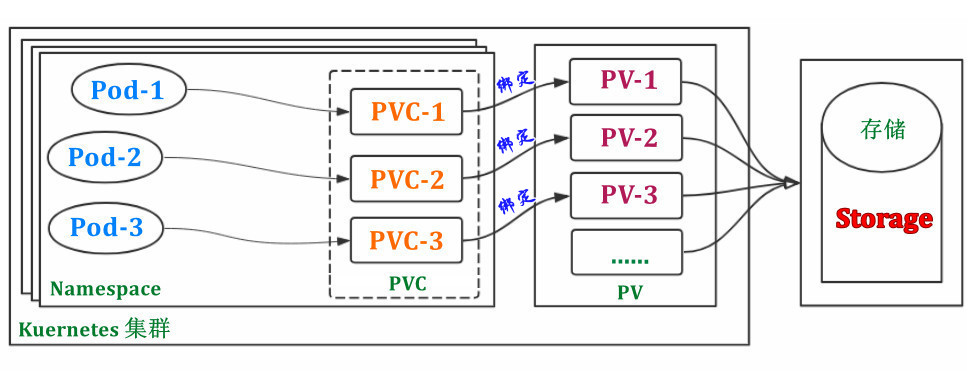
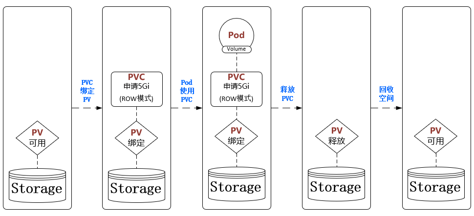

# Kubernetes持久化存储PV、PVC和StorageClass介绍

### PV和PVC

Kubernetes Volume提供了非常好的数据持久化方案，不过对于大型Kubernetes集群来说管理上还有不方便之处。Volume方案需要创建Pod或者Deployment的管理员对共享存储的参数和机制比较清楚，甚至对一些存储的访问是需要身份验证的，这导致集群用户（存储使用者）和系统管理员（存储管理员）的职责耦合在一起了。但对于大型的生产环境，为了管理的效率和安全，集群用户（存储使用者）和系统管理员（存储管理员）是分置的。

Kubernetes引入了两个新的API资源PersistentVolume和PersistentVolumeClaim来解决这个问题。

PersistentVolume（PV）是集群中由系统管理员配置的一段网络存储。它是集群中的资源，就像node是集群资源一样。PV也是像是Volumes一样的存储插件，但其生命周期独立于使用PV的任何单个Pod。PV配置存储实现的详细信息，包括NFS，iSCSI或特定于云提供程序的存储系统。PV属于集群级别资源，不属于任何的Namespace。

PersistentVolumeClaim（PVC）是使用存储的请求，属于Namespace中的资源。PVC类似于Pod，Pod消耗node资源，PVC消耗PV资源。Pod可以请求特定级别的计算资源（CPU和内存），PVC可以请求特定大小和访问模式的存储资源。

PV由系统管理员创建和维护，系统管理员会根据后端存储系统的特点以及访问需求（访问模式和容量）创建不同的PV，系统管理员不用关心哪些Pod会使用这些PV。PVC由集群用户创建和维护，PVC指明需求的存储资源的访问模式和容量大小，Kubernetes会根据PVC的需求自动查找并提供满足条件的PV，开发人员提出PVC请求时不用关心真正的存储资源在哪儿，如何访问等底层信息。

下面采用NFS共享存储举一个例子进行说明。NFS服务器的搭建请参见[NFS v4的安装和使用-CentOS 7](../nfs/nfs-v4-centos-installation-introduction.md)。并创建一个新的共享目录。

    mkdir /data/pvpvc -p
    chmod 777 /data/pvpvc
    
    vim /etc/exports
    /data/pvpvc                     192.168.1.0/24(sync,rw,no_root_squash)

    exportfs -r

    showmount -e nfs
    Export list for nfs:
    /data/pvpvc    192.168.1.0/24

在Kubernetes的所有worker节点安装NFS客户端，并测试是否能够连接NFS服务器。

    yum install -y nfs-utils

    showmount -e 192.168.1.80
    Export list for 192.168.1.80:
    /data/pvpvc      192.168.1.0/24

创建PV和PVC，PVC和PV之间没有依靠ID、名称或者label匹配，而是靠容量和访问模式，PVC的容量和访问模式需要是某个PV的子集才能自动匹配上。注意：PVC和PV是一对一的，也即一个PV被一个PVC自动匹配后，不会再被其它PVC匹配了，即使PVC需求能够完全满足。

    vi my-nfs-pv.yaml
    apiVersion: v1
    kind: PersistentVolume
    metadata:
      name: my-nfs-pv
    spec:
      #容量参数
      capacity:
        storage: 2Gi
      #访问模式
      accessModes:
        - ReadWriteMany
        - ReadWriteOnce
        - ReadOnlyMany
      #后端共享存储访问参数
      nfs:
        path: /data/pvpvc
        server: 192.168.1.80
    
    vi my-nfs-pvc.yaml
    kind: PersistentVolumeClaim
    apiVersion: v1
    metadata:
      name: my-nfs-pvc
    spec:
      #访问模式需求
      accessModes:
        - ReadWriteMany
      #资源（容量）请求      
      resources:
        requests:
          storage: 2Gi
    
    kubectl apply -f my-nfs-pv.yaml
    
    kubectl get pv
    NAME        CAPACITY   ACCESS MODES   RECLAIM POLICY   STATUS      CLAIM   STORAGECLASS   REASON   AGE
    my-nfs-pv   2Gi        RWX            Retain           Available                                   14s
    
    kubectl apply -f my-nfs-pvc.yaml
    
    #发现PVC已经和PV自动匹配上
    kubectl get pv
    NAME        CAPACITY   ACCESS MODES   RECLAIM POLICY   STATUS   CLAIM                STORAGECLASS   REASON   AGE
    my-nfs-pv   2Gi        RWX            Retain           Bound    default/my-nfs-pvc                           49s
    
    kubectl get pvc
    NAME         STATUS   VOLUME      CAPACITY   ACCESS MODES   STORAGECLASS   AGE
    my-nfs-pvc   Bound    my-nfs-pv   2Gi        RWX                           23s

使用pvc创建Pod。Pod通过volumes来声明使用哪个PVC，直接使用PVC的名字即可，可见在创建Pod时无需再关心共享存储的细节了。Pod会向存储卷中写入数据。

    vi my-pvpvc-pod.yaml
    ---
    apiVersion: v1
    kind: Pod
    metadata:
      name: my-pvpvc-pod
    spec:
      volumes:
        - name: my-nfs-pvc-vol
          persistentVolumeClaim:
            claimName: my-nfs-pvc
      containers:
        - name: busybox
          image: busybox:latest
          volumeMounts:
            - mountPath: /data
              name: my-nfs-pvc-vol
          command:
            - "/bin/sh"
            - "-c"
            - "echo 'hello world' >> /data/hello.txt; sleep 3600"

在NFS服务器中查看，确实有文件生成。

    cat /data/pvpvc/hello.txt
    hello world

PV访问模式
- ReadWriteMany：多路读写，卷能被集群多个节点挂载并读写
- ReadWriteOnce：单路读写，卷只能被单个集群节点挂载读写
- ReadOnlyMany：多路只读，卷能被多个集群节点挂载且只能读

PV和PVC之间的相互作用遵循以下生命周期：Provisioning --> Binding --> Using --> Reclaiming
- 供应Provisioning：通过集群外的存储系统或者云平台来提供存储持久化支持。
    - 静态供应Static：系统管理员创建多个PV，它们携带可供集群用户使用的真实存储的详细信息。 它们存在于Kubernetes API中，可用于消费。
    - 动态供应Dynamic：当管理员创建的静态PV都不匹配用户的PersistentVolumeClaim时，集群可能会尝试为PVC动态配置卷，此配置基于StorageClasses。StorageClasses后面会展开讲。
- 绑定Binding：集群用户创建PVC并指定需要的资源和访问模式。在找到可用PV之前，PVC会保持未绑定状态。PVC与PV的绑定是一对一的映射。
- 使用Using：用户可在Pod中像volume一样使用PVC。
- 回收Reclaiming：集群用户可以删除PVC来回收存储资源，回收策略告诉Kubernetes集群在删除PVC后如何处理该存储卷：保留Retain，回收Recycle和删除Delete。注意：外部存储支持哪几种回收策略需要视外部存储系统特性决定。
    - 保留Retain：允许手动处理回收资源。删除PVC后PV将变成”Released“状态，但该PV是无法应用于其它PVC，因为其上还有前一个PVC的数据。系统管理员可以先删除PV；PV删除后共享存储仍然存在，系统管理员需要手动处理共享存储中的数据；此时系统管理员可以重新为该共享存储创建PVC，也可以直接删除该共享存储。
    - 删除Delete：删除操作会同时从Kubernetes中删除PersistentVolume对象以及外部存储系统中的关联的共享存储。
    - 回收Recycle：该策略已被废弃，被StorageClasses替代。

接着上面的例子，可以看出my-nfs-pv没有配置回收策略，其缺省为Retain，状态为Bound。我们依次删除Pod和PVC。

    kubectl delete -f my-pvpvc-pod.yaml
    kubectl delete -f my-nfs-pvc.yaml

再次查看PVC和PV，PV状态为Released。而且PV的CLAIM字段仍然还保留着default/my-nfs-pvc，顽固的表明其和PVC的一对一的绑定关系。NFS服务器中的文件仍然还在。

    kubectl get pvc
    No resources found in default namespace.

    kubectl get pv
    NAME        CAPACITY   ACCESS MODES   RECLAIM POLICY   STATUS     CLAIM                STORAGECLASS   REASON   AGE
    my-nfs-pv   2Gi        RWX            Retain           Released   default/my-nfs-pvc                           59m

    cat /data/pvpvc/hello.txt
    hello world

此时在创建一个新的PVC，其需求和上一个PVC完全相同，能够匹配PV。

    vi my-nfs-pvc-2.yaml
    kind: PersistentVolumeClaim
    apiVersion: v1
    metadata:
      name: my-nfs-pvc-2
    spec:
      accessModes:
        - ReadWriteMany
      resources:
        requests:
          storage: 2Gi

    kubectl apply -f my-nfs-pvc-2.yaml

可以发现my-nfs-pvc-2并没有绑定此PV，它在等待和自己匹配的PV的新创建。原有的PV并不会被重新分配出去。

    kubectl get pvc
    NAME           STATUS    VOLUME   CAPACITY   ACCESS MODES   STORAGECLASS   AGE
    my-nfs-pvc-2   Pending                                                     9s
    kubectl get pv
    NAME        CAPACITY   ACCESS MODES   RECLAIM POLICY   STATUS     CLAIM                STORAGECLASS   REASON   AGE
    my-nfs-pv   2Gi        RWX            Retain           Released   default/my-nfs-pvc                           66m

此时删除PV，NFS服务器中的文件仍然还在。

    kubectl delete -f my-nfs-pv.yaml

    cat /data/pvpvc/hello.txt
    hello world

不修改my-nfs-pv.yaml，直接重新创建PV。可以发现新的PVC和新的PV已经绑定起来了，但此PVC和PV已经非彼PVC和PV了。

    kubectl apply -f my-nfs-pv.yaml

    kubectl get pvc
    NAME           STATUS   VOLUME      CAPACITY   ACCESS MODES   STORAGECLASS   AGE
    my-nfs-pvc-2   Bound    my-nfs-pv   2Gi        RWX                           10m
    kubectl get pv
    NAME        CAPACITY   ACCESS MODES   RECLAIM POLICY   STATUS   CLAIM                  STORAGECLASS   REASON   AGE
    my-nfs-pv   2Gi        RWX            Retain           Bound    default/my-nfs-pvc-2                           32s

重新创建Pod，注意使用新的my-nfs-pvc-2。可以发现NFS服务器的文件被重复使用。

    vi my-pvpvc-pod-2.yaml
    ---
    apiVersion: v1
    kind: Pod
    metadata:
      name: my-pvpvc-pod
    spec:
      volumes:
        - name: my-nfs-pvc-vol
          persistentVolumeClaim:
            claimName: my-nfs-pvc-2
      containers:
        - name: busybox
          image: busybox:latest
          volumeMounts:
            - mountPath: /data
              name: my-nfs-pvc-vol
          command:
            - "/bin/sh"
            - "-c"
            - "echo 'hello world' >> /data/hello.txt; sleep 3600"

    kubectl apply -f my-pvpvc-pod-2.yaml

    cat /data/pvpvc/hello.txt
    hello world
    hello world

当一个Pod被调度到一个node节点，kubelet会为Pod创建Pod对应的目录/var/lib/kubelet/pods/<PodID>。my-pvpvc-pod被调度到k8s-node1节点，所以会在k8s-node1节点创建Pod目录/var/lib/kubelet/pods/5757df8b-fd9c-43f8-a660-60177de1e9ea。

    kubectl get pod -o wide
    NAME                 READY   STATUS    RESTARTS   AGE    IP             NODE         NOMINATED NODE   READINESS GATES
    my-pvpvc-pod         1/1     Running   23         23h    10.244.1.48    k8s-node1    <none>           <none>
    
    kubectl get pod my-pvpvc-pod -o yaml | grep uid
      uid: 5757df8b-fd9c-43f8-a660-60177de1e9ea
    
    cd /var/lib/kubelet/pods/5757df8b-fd9c-43f8-a660-60177de1e9ea
    ls
    containers  etc-hosts  plugins  volumes

当创建Pod时，同时也会创建存储卷目录/volumes/kubernetes.io~<Volume类型>/<Volume名字>，并将共享存储mount到该目录。可以看出k8s-node1节点Mount了两个目录，其中一个为Secret，一个为NFS。hello.txt文件就是NFS服务器的hello.txt文件。

kubelet将远程共享存储Mount到Pod宿主机上。容器想使用该存储卷还需要将该宿主机上的目录挂载到容器中。

    mount | grep 5757df8b-fd9c-43f8-a660-60177de1e9ea
    tmpfs on /var/lib/kubelet/pods/5757df8b-fd9c-43f8-a660-60177de1e9ea/volumes/kubernetes.io~secret/default-token-wtqgl type tmpfs (rw,relatime)
    192.168.1.80:/data/pvpvc on /var/lib/kubelet/pods/5757df8b-fd9c-43f8-a660-60177de1e9ea/volumes/kubernetes.io~nfs/my-nfs-pv type nfs4 (rw,relatime,vers=4.1,rsize=131072,wsize=131072,namlen=255,hard,proto=tcp,timeo=600,retrans=2,sec=sys,clientaddr=192.168.1.56,local_lock=none,addr=192.168.1.80)
    
    cd /volumes/kubernetes.io~nfs/my-nfs-pv
    cat hello.txt
    hello world
    hello world

### StorageClass

在静态供应模式下，这需要系统管理员需要提前准备好各种不同资源（容量）和访问模式的存储资源。但在大规模集群中会需要众多PV，如果这些PV都需要系统管理员手动逐个创建是很繁琐的。所以Kubernetes又提供了动态供应模式，动态供应的关键是StorageClass，StorageClass的作用就像是创建PV模板，当PVC发出存储资源（容量和访问模式）请求时，Kubernetes的供应者Provisioner根据StorageClass来动态创建PV。StorageClass并不会事先定义PV提供的容量和访问模式，而是根据PVC的容量和访问模式需求自动创建的对应的PV。系统管理员可以针对不同的后端共享存储类型封装不同的StorageClasses供PVC使用。

下面演示一下如何利用StorageClasses来动态创建PV。在NFS服务器创建一个新的共享目录。

    mkdir /data/sc -p
    chmod 777 /data/sc
    
    vim /etc/exports
    /data/sc                     192.168.1.0/24(sync,rw,no_root_squash)

    exportfs -r

    showmount -e nfs
    Export list for nfs:
    /data/sc      192.168.1.0/24

在Kubernetes的所有worker节点测试是否能够连接NFS服务器。

    showmount -e 192.168.1.80
    Export list for 192.168.1.80:
    /data/sc        192.168.1.0/24
    /data/pvpvc     192.168.1.0/24

Kubernetes官方提供内置的StorageClass的供应者[Provisioner](https://kubernetes.io/docs/concepts/storage/storage-classes/#provisioner)，但其中是不支持NFS的，不过有支持NFS的外置的Provisioner，通过helm安装nfs-cleint-provisioner。

    helm install nfs-provisioner stable/nfs-client-provisioner --set nfs.server=192.168.1.80 --set nfs.path=/data/sc
    
    #注意StorageClass的名称nfs-client
    kubectl get storageclass
    NAME         PROVISIONER                                            AGE
    nfs-client   cluster.local/nfs-provisioner-nfs-client-provisioner   36m
    
    kubectl get all
    NAME                                                         READY   STATUS    RESTARTS   AGE
    pod/nfs-provisioner-nfs-client-provisioner-bbd974457-g9p9m   1/1     Running   0          86s
    
    NAME                 TYPE        CLUSTER-IP   EXTERNAL-IP   PORT(S)   AGE
    service/kubernetes   ClusterIP   10.1.0.1     <none>        443/TCP   27d
    
    NAME                                                     READY   UP-TO-DATE   AVAILABLE   AGE
    deployment.apps/nfs-provisioner-nfs-client-provisioner   1/1     1            1           86s
    
    NAME                                                               DESIRED   CURRENT   READY   AGE
    replicaset.apps/nfs-provisioner-nfs-client-provisioner-bbd974457   1         1         1       86s

创建PVC，其中storageClassName关联的就是StorageClass的名称nfs-client，在创建PVC时会关联StorageClass然后自动创建PV，并绑定上去。注意PV的容量为100Mi，访问模式为ReadWriteOnce，回收策略是Delete。

    vi my-sc-pvc-rwo-100m.yaml
    ---
    apiVersion: v1
    kind: PersistentVolumeClaim
    metadata:
      name: my-sc-pvc-rwo-100m
    spec:
      storageClassName: nfs-client
      accessModes:
        - ReadWriteOnce
      resources:
        requests:
          storage: 100Mi
    
    kubectl apply -f my-sc-pvc-rwo-100m.yaml
    
    kubectl get pvc
    NAME                 STATUS   VOLUME                                     CAPACITY   ACCESS MODES   STORAGECLASS   AGE
    my-sc-pvc-rwo-100m   Bound    pvc-9640b177-0c66-42b0-9ede-cffa59a82673   100Mi      RWO            nfs-client     11s
    
    kubectl get pv
    NAME                                       CAPACITY   ACCESS MODES   RECLAIM POLICY   STATUS   CLAIM                        STORAGECLASS   REASON   AGE
    pvc-9640b177-0c66-42b0-9ede-cffa59a82673   100Mi      RWO            Delete           Bound    default/my-sc-pvc-rwo-100m   nfs-client              35s

创建Pod，可以看出Pod存储卷配置和静态供给方式没有任何区别。

    vi my-sc-pod.yaml
    apiVersion: v1
    kind: Pod
    metadata:
      name: my-sc-pod
    spec:
      volumes:
        - name: my-sc-pvc-vol
          persistentVolumeClaim:
            claimName: my-sc-pvc-rwo-100m
      containers:
        - name: busybox
          image: busybox:latest
          volumeMounts:
            - mountPath: /data
              name: my-sc-pvc-vol
          command:
            - "/bin/sh"
            - "-c"
            - "echo 'hello world' >> /data/hello.txt; sleep 3600"

    kubectl apply -f my-sc-pod.yaml

NFS服务器有文件创建。

    cd /data/sc/
    ls
    default-my-sc-pvc-rwo-100m-pvc-9640b177-0c66-42b0-9ede-cffa59a82673
    cd default-my-sc-pvc-rwo-100m-pvc-9640b177-0c66-42b0-9ede-cffa59a82673/
    ls
    hello.txt
    cat hello.txt
    hello world

再创建一个新的PVC，其中容量和访问模式不同。可以发现自动创建了对应需求的PV。

    vi my-sc-pvc-rwx-200m.yaml
    ---
    apiVersion: v1
    kind: PersistentVolumeClaim
    metadata:
      name: my-sc-pvc-rwx-200m
    spec:
      storageClassName: nfs-client
      accessModes:
        - ReadWriteMany
      resources:
        requests:
          storage: 200Mi

    kubectl apply -f my-sc-pvc-rwx-200m.yaml
    
    kubectl get pvc
    NAME                 STATUS   VOLUME                                     CAPACITY   ACCESS MODES   STORAGECLASS   AGE
    my-sc-pvc-rwx-200m   Bound    pvc-f987075d-aa2c-4d7b-a19e-607e2416af72   200Mi      RWX            nfs-client     13s
    my-sc-pvc-rwo-100m   Bound    pvc-9640b177-0c66-42b0-9ede-cffa59a82673   100Mi      RWO            nfs-client     20m
    
    kubectl get pv
    NAME                                       CAPACITY   ACCESS MODES   RECLAIM POLICY   STATUS   CLAIM                        STORAGECLASS   REASON   AGE
    pvc-9640b177-0c66-42b0-9ede-cffa59a82673   100Mi      RWO            Delete           Bound    default/my-sc-pvc-rwo-100m   nfs-client              20m
    pvc-f987075d-aa2c-4d7b-a19e-607e2416af72   200Mi      RWX            Delete           Bound    default/my-sc-pvc-rwx-200m   nfs-client              17s

删除Pod和PVC，再到NFS服务器查看，看到共享存储目录已经改为归档archived-default-my-sc-pvc-pvc-430a5b2f-36df-4a41-9432-0005aa5a460c，并且其中文件仍然存在。如果要重新使用需要手动操作了。

    kubectl delete -f my-sc-pod.yaml
    kubectl delete -f my-sc-pvc-rwo-100m.yaml

    cd /data/sc
    ls
    default-my-sc-pvc-rwx-200m-pvc-f987075d-aa2c-4d7b-a19e-607e2416af72  archived-default-my-sc-pvc-rwo-100m-pvc-9640b177-0c66-42b0-9ede-cffa59a82673
    cd archived-default-my-sc-pvc-rwo-100m-pvc-9640b177-0c66-42b0-9ede-cffa59a82673/
    ls
    hello.txt